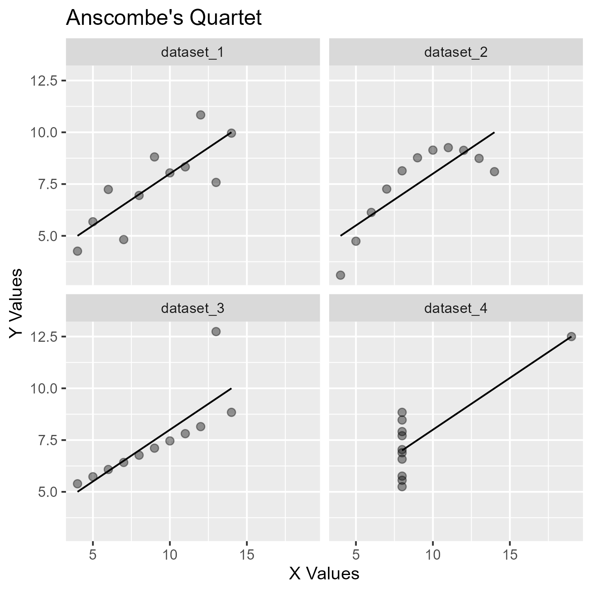

```{r setup, include=FALSE}
rm(list=ls())
library(tidyverse)
```

**Visualising** your data is important!\
Summary statistics can be highly misleading, and simply plotting them can reveal a lot more!\
Lets take a closer look at two datasets...

------------------------------------------------------------------------

# Problem 1

Anscombe, F. J. (1973). Graphs in statistical analysis. *American Statistician, 27*(1), 17–21. <doi:10.1080/00031305.1973.10478966>.

```{r setup, include=FALSE}
anscombe_quartet <- readRDS("anscombe quartet.rds")  # Load the data
```

## Let's explore the dataset

```{r, echo=TRUE, eval=FALSE}
str(anscombe_quartet)
```

The **str() function** compactly displays a *compact, structural summary* of the dataset. It is used to quickly inspect the structure, showing variable types, sizes, and first few values for each variable.

We can see that this data contains four different sub-datasets, with numerical x and y variables.

## Let's check some summary statistics

```{r, echo=TRUE}
anscombe_quartet %>% 
  group_by(dataset) %>% 
  summarise(
    mean_x      = mean(x),
    mean_y      = mean(y),
    min_x       = min(x),
    min_y       = min(y),
    max_x       = max(x),
    max_y       = max(y),
    correlation = cor(x, y)
  )
```

The summary statistics highlight that the Anscombe's Quartet datasets share nearly **identical statistical properties**.

## Let's plot the data with ggplot2

```{r anscombe_plot, echo=FALSE}
library(ggplot2)

p1 <- ggplot(anscombe_quartet, aes(x = x, y = y)) +
  geom_point(size = 2, alpha = 0.4) + 
  geom_smooth(method = "lm", formula = y ~ x, se = FALSE, color = "black", size = 0.5) +
  facet_wrap(~dataset) +
  labs(
    title = "Anscombe's Quartet",
    x = "X Values",
    y = "Y Values"
  )

# saving plot for printing
ggsave("anscombe_plot.png", plot = p1, width = 5, height = 5, dpi = 300)

```

```{r display_plot, echo=FALSE}
# Display the saved plot in the document

```

The plots demonstrate that despite having very similar summary statistics, the four datasets have **very different distributions**.

-   *Dataset 1:* linear relationship, **strong positive correlation** between x and y (linear regression would be appropriate)
-   *Dataset 2:* non-linear, **quadratic relationship** (hence, linear regression wouldn't be appropriate)
-   *Dataset 3:* linear relationship with an **outlier** (most points follow a linear trend, but the outlier distorts a linear regression)
-   *Dataset 4:* points have the **same x value** with different y values, and one extreme outlier (linear regression wouldn't be appropriate)

Overall... we should always visualise data instead of relying on summary statistics and making assumptions.

------------------------------------------------------------------------

# Problem 2

```{r setup, include=FALSE}
datasaurus_dozen <- readRDS("datasaurus_dozen.rds")
```

## Let's explore the dataset

```{r, echo=TRUE, eval=FALSE}
str(datasaurus_dozen)
```